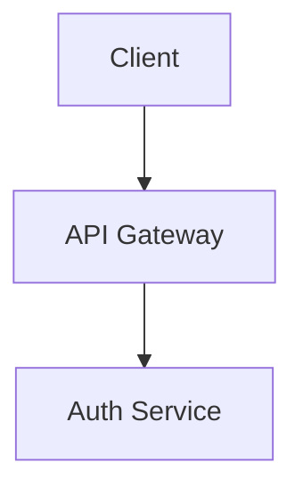

# Xây dựng ứng dụng tư vấn pháp luật sử dụng AI

Tất cả các microservices: Ghi lại thông tin request (request logs)

Tất cả các microservices: có request_id, code, success, message, data, total

# Tổng quan các microservices

# Chi tiết các microservices

## Auth Service

- Người dùng đăng nhập bằng google
- Gửi email để xác nhận email
- Người dùng xác nhận email
- Xác thực 2FA bằng TOTP
- Chuyển 1 user thành admin (cần Role ADMIN)
- Thông tin cá nhân
- Cập nhật ảnh avatar
